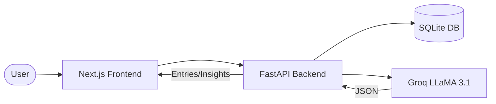

# 🌿 AI-Assisted Journal System

An AI-powered journaling platform for nature session participants. After each immersive session (forest, ocean, or mountain), users write a journal entry describing how they feel. The system stores entries, analyzes emotions using **Groq LLaMA-3.1**, and surfaces mental-health insights over time.

---

## Tech Stack

| Layer     | Technology                     |
|-----------|-------------------------------|
| Backend   | Python · FastAPI               |
| Database  | SQLite · SQLAlchemy ORM        |
| LLM       | Groq API · LLaMA 3.1 (8B)     |
| Frontend  | React · Next.js 14             |

---

## System Design & Architecture

The system follows a modern decoupled architecture, ensuring separation of concerns between the user interface, the API layer, and the intelligence engine.

### High-Level Data Flow



### 1. Frontend Layer (Next.js 14)
- **Component-Driven UI**: Built with reusable React components (`JournalForm`, `EntryList`, `Insights`).
- **Interactive States**: Uses React `useState` and `useEffect` for real-time updates without page reloads.
- **Tabbed Navigation**: Seamless switching between writing, viewing history, and analyzing metrics.
- **Axios Integration**: Robust HTTP client for parallel fetching of entries and aggregated insights.

### 2. Backend Layer (FastAPI)
- **Asynchronous Ready**: High-performance Python API designed for concurrency.
- **Dependency Injection**: Uses `get_db` generator to manage database sessions efficiently, ensuring connections are closed after every request.
- **Type Safety**: Leveraging Pydantic (v2) for strict request validation and response serialization.
- **Router Logic**: Clean separation between standard CRUD (create/get) and computational logic (insights/LLM).

### 3. Database Layer (SQLAlchemy + SQLite)
- **Relational Schema**: A dedicated `JournalEntry` table stores the core data.
- **Persistent Analysis**: Unlike many "chat" systems, this system persists LLM results (`emotion`, `keywords`, `summary`) directly back to the database row to prevent redundant (and costly) API calls.
- **Indexing**: `userId` is indexed for sub-millisecond lookups as the journal grows.

### 4. Intelligence Layer (Groq + LLaMA-3.1-8B)
- **High-Speed Inference**: Powered by Groq’s LPU (Language Processing Unit), resulting in near-instant emotion analysis.
- **Structured Output**: The system uses specialized prompt engineering to force the LLM to return valid JSON, which is then parsed into the backend's Pydantic models.
- **Robustness**: The pipeline includes regex-based JSON extraction to handle any accidental conversational "chatter" from the LLM.

### 5. Insight Engine
- **Aggregation Logic**: A specialized `insights.py` module that performs on-the-fly computation of:
    - User's most frequent emotional state.
    - Most visited nature environment (Favourite Ambience).
    - Longitudinal keyword analysis across recent sessions.

---

## Project Structure

```
ai-journal-system/
├── backend/
│   ├── main.py          # FastAPI app & all endpoints
│   ├── database.py      # SQLAlchemy engine & session
│   ├── models.py        # JournalEntry ORM model
│   ├── schemas.py       # Pydantic request/response schemas
│   ├── llm.py           # Groq LLaMA-3 integration
│   ├── insights.py      # Aggregation logic
│   ├── .env             # Groq API Key storage
│   └── requirements.txt
├── frontend/
│   ├── package.json
│   └── src/
│       ├── app/
│       │   ├── page.js       # Main page (tabs for Journal, Entries, Insights)
│       │   ├── layout.js     # Root layout
│       │   └── globals.css   # Design system & global styles
│       └── components/
│           ├── JournalForm.js # Write & submit entries
│           ├── EntryList.js   # View & analyze entries
│           └── Insights.js    # Aggregated stats
└── ARCHITECTURE.md
```

---

## Prerequisites

- **Python 3.10+**
- **Node.js 18+** and npm
- A free **[Groq API key](https://console.groq.com/)** (model: `llama-3.1-8b-instant`)

---

## Installation & Running

### 1. Clone / navigate to the project

```bash
cd ai-journal-system
```

### 2. Backend

```bash
cd backend

# Create and activate a virtual environment
python -m venv venv
venv\Scripts\activate

# Install dependencies
pip install -r requirements.txt

# Run the server
uvicorn main:app --reload --port 8000
```

> [!NOTE]
> The Groq API key is already configured in `backend/.env`.

### 3. Frontend

Open a **new terminal**:

```bash
cd frontend
npm install
npm run dev
```

The frontend will be available at **http://localhost:3000**.

---

## API Reference

### `POST /api/journal` — Create Entry
### `GET /api/journal/{userId}` — Get User Entries
### `POST /api/journal/analyze` — Analyze Text (LLM)
### `GET /api/journal/insights/{userId}` — Insights

---

## LLM Details

- **Provider:** [Groq](https://groq.com/)
- **Model:** `llama-3.1-8b-instant` (LLaMA 3.1 8B)
- **Purpose:** Emotion detection and mental state summary.
